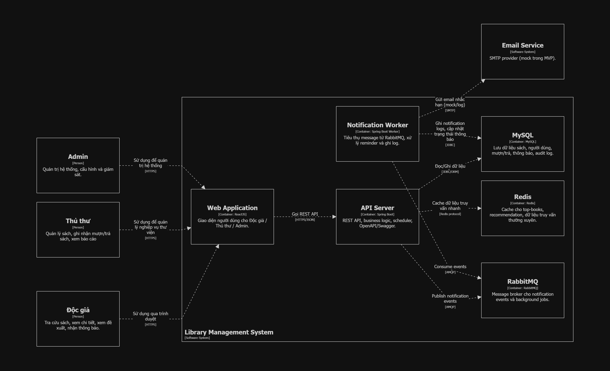

# Hệ thống quản lý thư viện số (Library-Management)

## Mô tả 
Hệ thống quản lý thư viện số được xây dựng nhằm hỗ trợ quản lý sách và hoạt động mượn/trả một cách hiệu quả. Hệ thống cho phép quản lý sách, tìm kiếm và phân loại theo nhiều tiêu chí khác nhau. Độc giả có thể mượn, trả sách và nhận thông báo nhắc nhở khi sắp đến hạn. Thủ thư và quản trị viên theo dõi thống kê, báo cáo hoạt động thư viện. Đồng thời, hệ thống hỗ trợ đề xuất sách phù hợp cho người đọc.

## Thành viên nhóm 
| MSSV | Họ tên | Vai trò |
|------------|------|-----------|
| Nguyễn Tiến Đạt | 2251012034 | Full-stack Developer |
| Phạm Minh Hạnh | 2151053015 |  |
| Phạm Tấn Thành | 2351050163 |  |

## Công nghệ sử dụng
- Backend: Spring Boot 
- Frontend: ReactJS 
- Database: MySQL 
- Message Queue: RabbitMQ 
- Container: Docker + Docker Compose 

## Kiến trúc 
- Kiến trúc hệ thống: Mô hình Client-Server
- Kiến trúc phần mềm: Kiên trúc phân tầng (Layered Architecture)
 

## Cài đặt và chạy 
### Yêu cầu
- Docker Desktop 
- Git 

### Chạy với Docker Compose 
- git clone https://github.com/NgnTienDat/Library-Management
- cd project-name 
- docker-compose up -d 

### Truy cập
- Frontend: http://localhost:3000 
- Backend API: http://localhost:8000 
- RabbitMQ Management: http://localhost:15672 

## Demo 
[Link video demo hoặc screenshots] 

## Tài liệu
- [ADRs](docs/adrs/)
- [API Documentation](docs/api/) 
