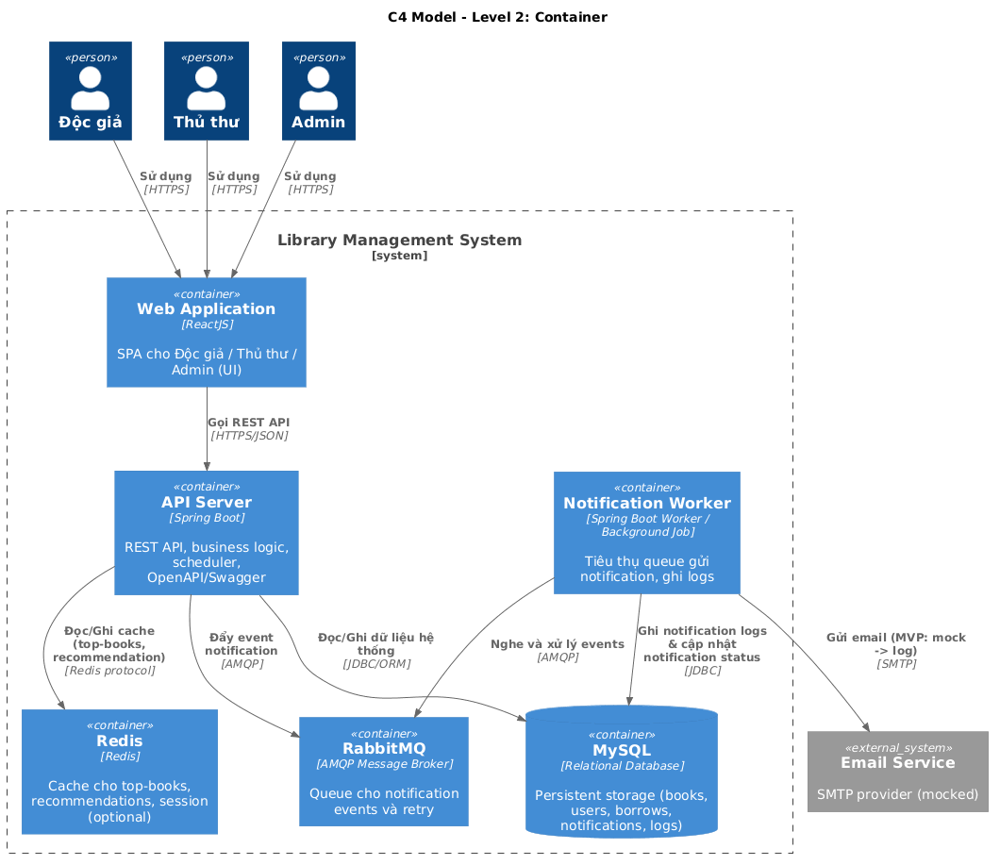

# Hệ thống quản lý thư viện số (Library-Management)

## Mô tả
Hệ thống quản lý thư viện số được xây dựng nhằm hỗ trợ quản lý sách và hoạt động mượn/trả một cách hiệu quả. Hệ thống cho phép quản lý sách, tìm kiếm và phân loại theo nhiều tiêu chí khác nhau. Độc giả có thể mượn, trả sách và nhận thông báo nhắc nhở khi sắp đến hạn. Thủ thư và quản trị viên theo dõi thống kê, báo cáo hoạt động thư viện. Đồng thời, hệ thống hỗ trợ đề xuất sách phù hợp cho người đọc.

## Thành viên nhóm
| Họ tên | MSSV | Vai trò |
|---|---|---|
| Nguyễn Tiến Đạt | 2251012034 | Full-stack Developer |
| Phạm Minh Hạnh | 2151053015 | Frontend Developer |
| Phạm Tấn Thành | 2351050163 | Frontend Developer |

## Công nghệ sử dụng
- Backend: Spring Boot
- Frontend: ReactJS (Vite)
- Database: MySQL, Redis
- Message Queue: RabbitMQ
- Container: Docker + Docker Compose

## Kiến trúc
- Kiến trúc hệ thống: Mô hình Client-Server
- Kiến trúc phần mềm: Kiến trúc phân tầng (Layered Architecture)


## Cài đặt và chạy

### 1. Yêu cầu môi trường

#### Bắt buộc (chạy theo Docker Compose)
- Docker Desktop (khuyến nghị 4.x trở lên)
- Docker Compose v2 (đi kèm Docker Desktop)
- Git

#### Bổ sung nếu chạy manual
- Java 21 (JDK 21)
- Maven 3.9+ (hoặc dùng Maven Wrapper `mvnw`/`mvnw.cmd`)
- Node.js 20+ và npm

### 2. Clone project
```bash
git clone https://github.com/NgnTienDat/Library-Management.git
cd Library-Management
```

### 3. Cấu hình môi trường
Project dùng file `.env` ở thư mục gốc để cấu hình backend/container.

Nếu repo có `.env.example`, copy thành `.env`:
```bash
cp .env.example .env
```

Trên Windows (PowerShell):
```powershell
Copy-Item .env.example .env
```

Nếu chưa có `.env.example`, tạo thủ công file `.env` với các nhóm biến quan trọng:
- MySQL: `MYSQL_ROOT_PASSWORD`, `MYSQL_DATABASE`, `MYSQL_USER`, `MYSQL_PASSWORD`
- Kết nối DB backend: `DBMS_CONNECTION`, `DBMS_USERNAME`, `DBMS_PASSWORD`
- Redis: `REDIS_HOST`, `REDIS_PORT`
- RabbitMQ: `RABBITMQ_HOST`, `RABBITMQ_USERNAME`, `RABBITMQ_PASSWORD`
- JWT/App: `SIGNER_KEY`, `ADMIN_EMAIL`, `ADMIN_PASSWORD`, `LIBRARIAN_EMAIL`, `LIBRARIAN_PASSWORD`
- Mail/Cloudinary (nếu dùng): `MAIL_USERNAME`, `MAIL_PASSWORD`, `CLOUDINARY_*`

Ví dụ cấu hình tối thiểu:
```env
MYSQL_ROOT_PASSWORD=root
MYSQL_DATABASE=oulib
MYSQL_USER=oulib
MYSQL_PASSWORD=oulib123

DBMS_CONNECTION=jdbc:mysql://mysql:3306/oulib
DBMS_USERNAME=oulib
DBMS_PASSWORD=oulib123

REDIS_HOST=redis
REDIS_PORT=6379

RABBITMQ_HOST=rabbitmq
RABBITMQ_USERNAME=oulib
RABBITMQ_PASSWORD=oulib

SIGNER_KEY=your_secure_signer_key
ADMIN_EMAIL=admin@example.com
ADMIN_PASSWORD=your_password
LIBRARIAN_EMAIL=librarian@example.com
LIBRARIAN_PASSWORD=your_password
```

### 4. Chạy bằng Docker Compose (chính)
Từ thư mục gốc project:

```bash
docker compose up -d --build
```

Hoặc cú pháp cũ:
```bash
docker-compose up -d --build
```

Giải thích:
- `-d`: chạy container dưới nền (detached mode)
- `--build`: build lại image trước khi chạy

Nếu dùng nhiều file compose (ví dụ có override):
```bash
docker compose -f docker-compose.yml -f docker-compose.override.yml up -d
```

### 5. Kiểm tra container
```bash
docker ps
```

Các service/container mong đợi:
- backend API (`api` / `oulib-api-server`)
- frontend (`frontend` / `oulib-frontend`)
- mysql (`mysql` / `oulib-database`)
- redis (`redis` / `oulib-redis-cache`)
- rabbitmq (`rabbitmq` / `oulib-rabbitmq-mq`)
- worker nền (`worker` / `oulib-worker-service`, nếu bật)

### 6. Truy cập hệ thống
- Frontend: http://localhost:3000
- Backend API: http://localhost:8080
- Swagger/OpenAPI: http://localhost:8080/swagger-ui/index.html
- RabbitMQ Management: http://localhost:15672
	- User mặc định: `oulib`
	- Password mặc định: `oulib`

### 7. Dừng hệ thống
```bash
docker compose down
```

Hoặc cú pháp cũ:
```bash
docker-compose down
```

Nếu muốn xóa cả volume dữ liệu:
```bash
docker compose down -v
```

## Chạy không dùng Docker (tùy chọn)

### 1. Khởi động hạ tầng (MySQL, Redis, RabbitMQ)
Bạn có thể chạy hạ tầng bằng Docker, còn backend/frontend chạy local:

```bash
docker compose up -d mysql redis rabbitmq
```

### 2. Chạy Backend (Spring Boot)
```bash
cd oulib-backend
mvn clean install
mvn spring-boot:run
```

Nếu dùng Maven Wrapper:
```bash
./mvnw spring-boot:run
```

Trên Windows:
```powershell
.\mvnw.cmd spring-boot:run
```

### 3. Chạy Frontend (React + Vite)
```bash
cd oulib-frontend
npm install
npm run dev
```

Lưu ý: project frontend dùng Vite nên lệnh dev chuẩn là `npm run dev` (không phải `npm start`).

## Troubleshooting

### 1. Lỗi port bị trùng
- Kiểm tra cổng đang dùng: `3000`, `8080`, `3307`, `6379`, `15672`
- Đổi mapping port trong `docker-compose.yml`, sau đó chạy lại:
```bash
docker compose up -d --build
```

### 2. Docker không chạy
- Mở Docker Desktop và chờ trạng thái `Engine running`
- Kiểm tra nhanh:
```bash
docker info
```

### 3. DB chưa ready, backend khởi động lỗi
Khởi động lại backend sau khi MySQL healthy:
```bash
docker restart oulib-api-server
```

### 4. Xem log để debug
```bash
docker logs -f <container-name>
```

Ví dụ:
```bash
docker logs -f oulib-api-server
docker logs -f oulib-database
docker logs -f oulib-frontend
```

## Cấu trúc thư mục (ngắn gọn)
```bash
oulib-backend/   # Spring Boot
oulib-frontend/  # React + Vite
docker-compose.yml
docs/
```

## Lưu ý quan trọng
- Lần đầu chạy có thể mất vài phút do cần build image.
- Nên cấp cho Docker tối thiểu 4GB RAM.
- Không commit file `.env` chứa thông tin nhạy cảm.

## Demo
[Link video demo hoặc screenshots]

## Tài liệu
- [ADRs](docs/adrs/)
- [API Documentation](docs/api/)
