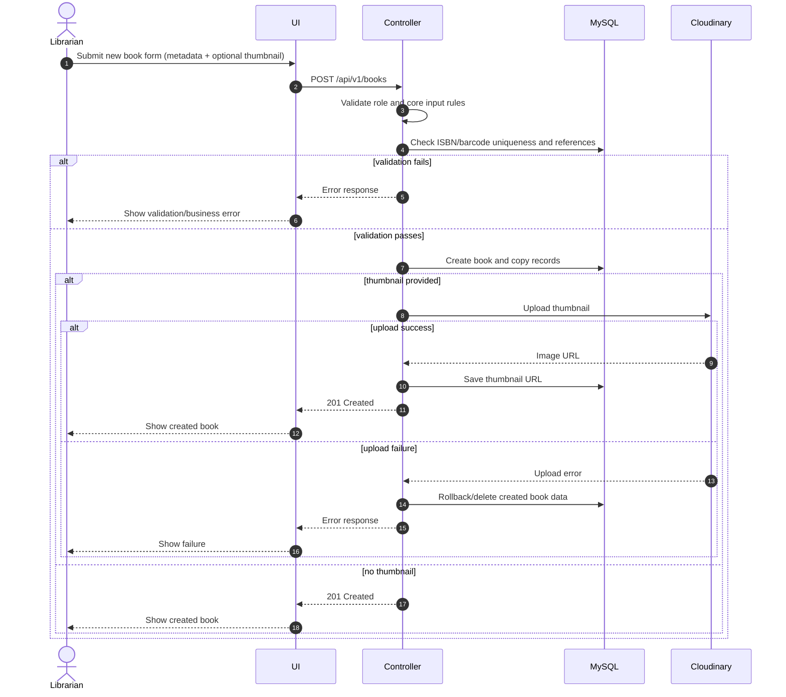

# Add Book

## Business Description

This operation allows a librarian to create a new book title with physical copy barcodes.
The flow validates copy counts, ISBN/barcode uniqueness, category existence, and author references before persisting data.
If an author id is absent, a new author is created; then the book and its copies are saved in MySQL in one transaction.
When a thumbnail is provided, the system uploads it to Cloudinary and stores the URL; on upload failure, the new database record is rolled back by deleting the inserted book.

 