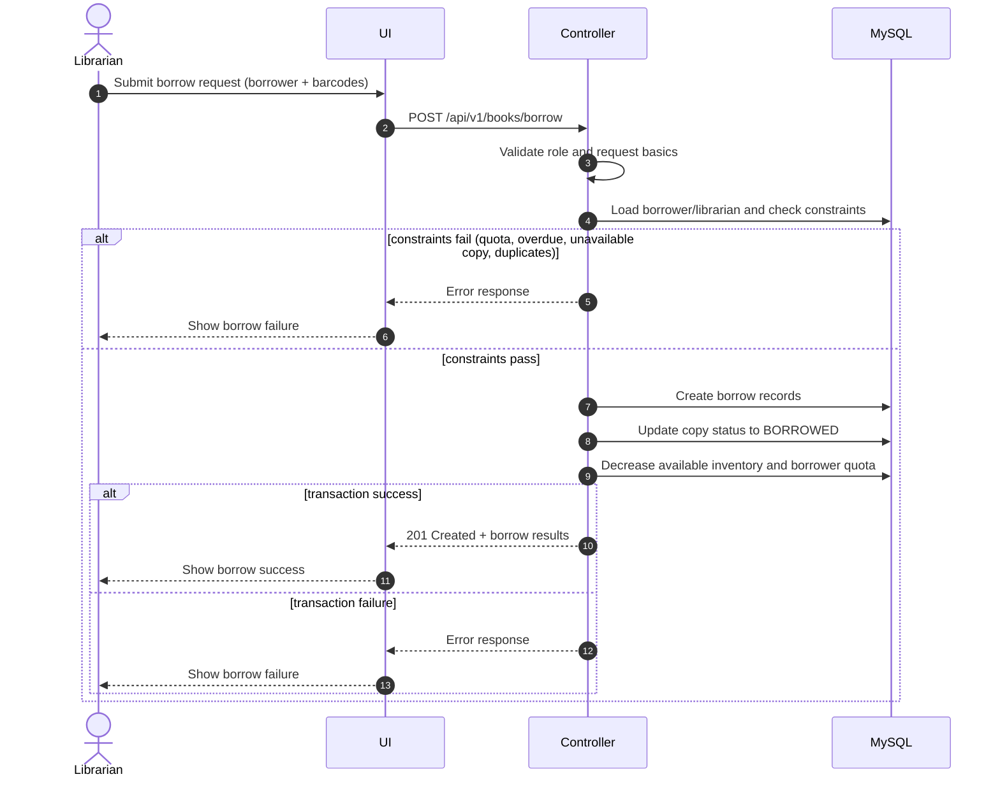

# Borrow Book

```mermaid
sequenceDiagram
    autonumber
    actor Librarian
    participant UI
    participant Controller
    participant MySQL

    Librarian->>UI: Submit borrow request (borrower + barcodes)
    UI->>Controller: POST /api/v1/books/borrow
    Controller->>Controller: Validate role and request basics
    Controller->>MySQL: Load borrower/librarian and check constraints

    alt constraints fail (quota, overdue, unavailable copy, duplicates)
        Controller-->>UI: Error response
        UI-->>Librarian: Show borrow failure
    else constraints pass
        Controller->>MySQL: Create borrow records
        Controller->>MySQL: Update copy status to BORROWED
        Controller->>MySQL: Decrease available inventory and borrower quota

        alt transaction success
            Controller-->>UI: 201 Created + borrow results
            UI-->>Librarian: Show borrow success
        else transaction failure
            Controller-->>UI: Error response
            UI-->>Librarian: Show borrow failure
        end
    end
```

