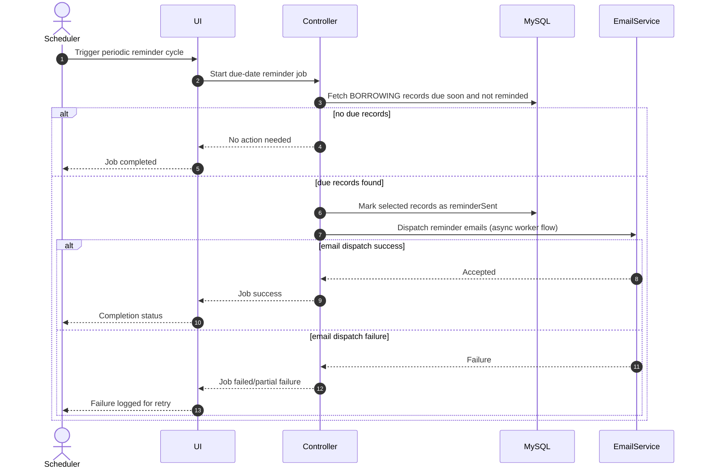

# Due Date Reminder

```mermaid
sequenceDiagram
    autonumber
    actor System as Scheduler
    participant UI
    participant Controller
    participant MySQL
    participant EmailService

    System->>UI: Trigger periodic reminder cycle
    UI->>Controller: Start due-date reminder job
    Controller->>MySQL: Fetch BORROWING records due soon and not reminded

    alt no due records
        Controller-->>UI: No action needed
        UI-->>System: Job completed
    else due records found
        Controller->>MySQL: Mark selected records as reminderSent
        Controller->>EmailService: Dispatch reminder emails (async worker flow)

        alt email dispatch success
            EmailService-->>Controller: Accepted
            Controller-->>UI: Job success
            UI-->>System: Completion status
        else email dispatch failure
            EmailService-->>Controller: Failure
            Controller-->>UI: Job failed/partial failure
            UI-->>System: Failure logged for retry
        end
    end
```

