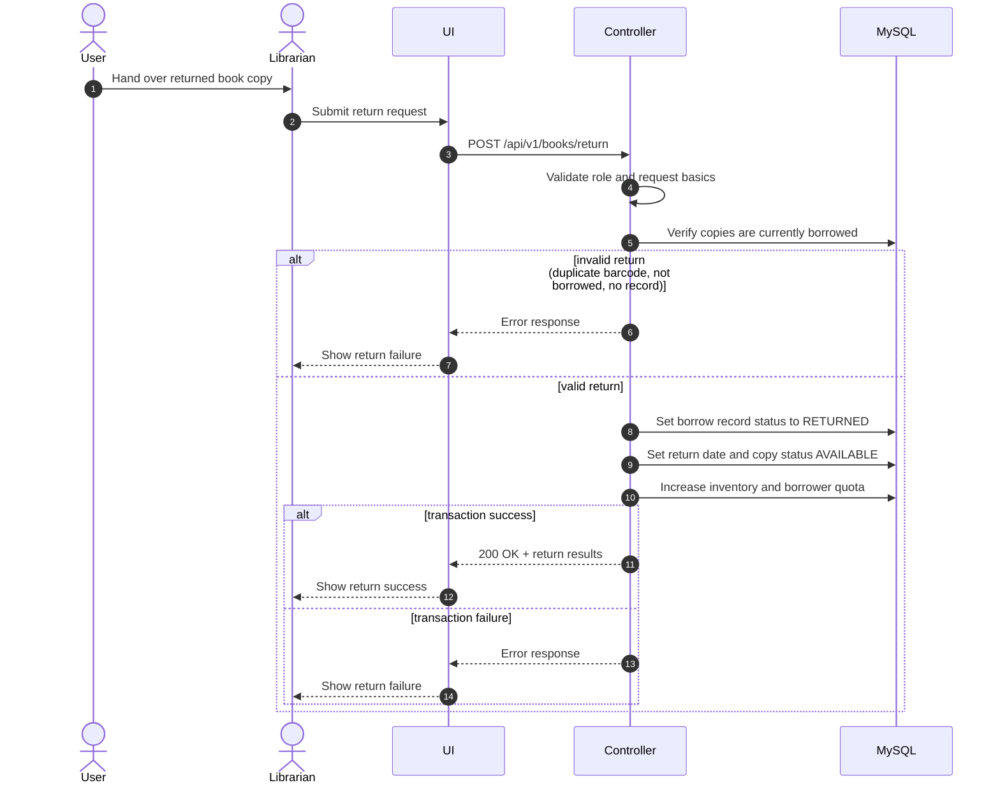

# Return Book

```mermaid
sequenceDiagram
    autonumber
    actor User
    actor Librarian
    participant UI
    participant Controller
    participant MySQL

    User->>Librarian: Hand over returned book copy
    Librarian->>UI: Submit return request
    UI->>Controller: POST /api/v1/books/return
    Controller->>Controller: Validate role and request basics
    Controller->>MySQL: Verify copies are currently borrowed

    alt invalid return (duplicate barcode, not borrowed, no record)
        Controller-->>UI: Error response
        UI-->>Librarian: Show return failure
    else valid return
        Controller->>MySQL: Set borrow record status to RETURNED
        Controller->>MySQL: Set return date and copy status AVAILABLE
        Controller->>MySQL: Increase inventory and borrower quota

        alt transaction success
            Controller-->>UI: 200 OK + return results
            UI-->>Librarian: Show return success
        else transaction failure
            Controller-->>UI: Error response
            UI-->>Librarian: Show return failure
        end
    end
```

